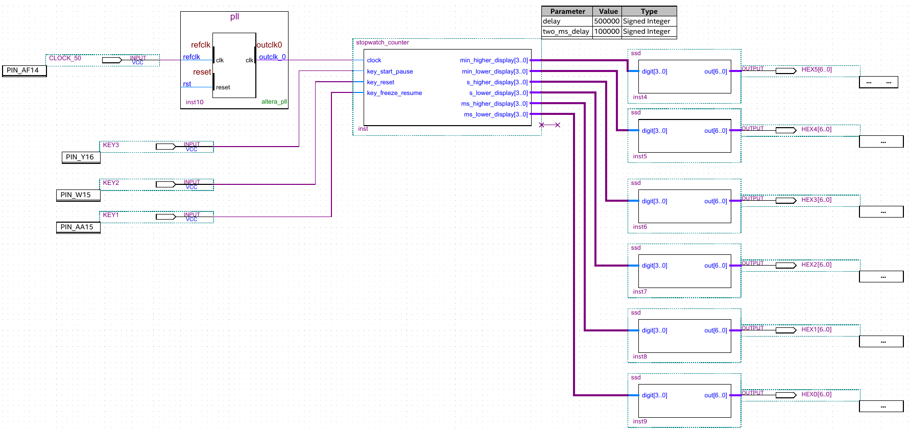

# 基于 Verilog 和 FPGA 的多功能秒表设计实验报告

517030910384 徐尚宁

## 实验目的

1. 初步掌握利用 Verilog 硬件描述语言进行逻辑功能设计的原理和方法。
2. 理解和掌握运用大规模可编程逻辑器件进行逻辑设计的原理和方法。
3. 理解硬件实现方法中的并行性，联系软件实现方法中的并发性。
4. 理解硬件和软件是相辅相成、并在设计和应用方法上的优势互补的特点。
5. 本实验学习积累的 Verilog 硬件描述语言和对 FPGA/CPLD 的编程操作，是进行后续《计
算机组成原理》部分课程实验，设计实现计算机逻辑的基础。

## 前言

本次实验中将带有暂停、显示暂停和重置功能的秒表分为四个阶段设计：

1. 计时功能设计
2. 重置功能
3. 暂停功能
4. 显示暂停功能

## 设计

### 七段数码管译码器

译码器的设计不再赘述。与样例给出的代码不同的是，译码器和计数器模块是在电路图中
连接的，而不是在 Verilog 中实例化 `ssd` 直接连接。

```verilog
module ssd(digit, out);
   input [3:0] digit;
   output reg [6:0] out;
   always @(digit)
   case (digit)
      0: out <= 7'b1000000;
      1: out <= 7'b1111001;
      2: out <= 7'b0100100;
      3: out <= 7'b0110000;
      4: out <= 7'b0011001;
      5: out <= 7'b0010010;
      6: out <= 7'b0000010;
      7: out <= 7'b1111000;
      8: out <= 7'b0000000;
      9: out <= 7'b0010000;
      default: out <= 7'b1111111;
   endcase
endmodule
```

### 计时功能

利用 50 MHz 的时钟，在每个时钟信号的上升沿让 `counter` 加一。当 `counter` 计到
500000，即 10 ms 时，向前进位，即 `ms_higher` 加一。值得注意的是毫秒到秒是逢 100
进一，而后面秒和分钟都是逢 60 进一。当分钟位计到 60 时，会重置为 0。

```verilog
parameter delay = 500000;  // 500000 cycles of a 50 MHz clock make 10 ms

always @(posedge clock) begin
   if (~key_reset) begin
      counter = 0;
      counting_enable = 0;
      display_frozen = 0;
      min_higher = 0;
      min_lower = 0;
      s_higher = 0;
      s_lower = 0;
      ms_higher = 0;
      ms_lower = 0;
   end else begin
      counter = counter + counting_enable;
      if (counter == delay) begin
         counter = 0;
         ms_lower = ms_lower + 1'b1;

         if (ms_lower == 10) begin
            ms_lower = 0;
            ms_higher = ms_higher + 1'b1;

            if (ms_higher == 10) begin
               ms_higher = 0;
               s_lower = s_lower + 1'b1;

               if (s_lower == 10) begin
                  s_lower = 0;
                  s_higher = s_higher + 1'b1;

                  if (s_higher == 6) begin
                     s_higher = 0;
                     min_lower = min_lower + 1'b1;

                     if (min_lower == 10) begin
                        min_lower = 0;
                        min_higher = min_higher + 1'b1;

                        if (min_higher == 6)
                           min_higher = 0;
                     end
                  end
               end
            end
         end
      end
   end
end
```

### 重置功能

重置按键是不用消抖的，因为即使按下一次重置按钮产生多个信号，最终的效果和只产生一
个信号是一样的。代码中如果检测到有重置信号就将计数的变量置零。

```verilog
if (~key_reset) begin
   counter = 0;
   min_higher = 0;
   min_lower = 0;
   s_higher = 0;
   s_lower = 0;
   ms_higher = 0;
   ms_lower = 0;
```

### 开始/暂停功能

在暂停键的实现很简单：检测到暂停键的信号时，只需将 `counting_enable` 置 0，因为
在时钟沿时，

```verilog
counter = counter + counting_enable
```

当 `counting_enable` 为 0 时，`counter` 就不再增加。暂停键的消抖是在每个时钟沿采
样按键信号，如果在 2 ms 内采样的所有信号都是 0，即按键按下的信号，那么就将
`counting_enable` 取反。具体实现如下：

```verilog
always @(posedge clock) begin
   enable_count = key_start_pause ? 1'b0 : enable_count + 1'b1;

   if (enable_count == two_ms_delay)
      counting_enable = ~counting_enable;
```

### 显示暂停功能

显示暂停是由 `display_frozen` 控制。当 `display_frozen` 为 1 时，显示暂停。按键
部分实现与暂停键类似：

```verilog
always @(posedge clock) begin
   freeze_count = key_freeze_resume ? 1'b0 : freeze_count + 1'b1;

   if (freeze_count == two_ms_delay)
      display_frozen = ~display_frozen;
```

如果显示不处于暂停状态，内部计数器的值会实时更新显示计数器的值。相反，当显示暂停
时，内部继续计数，只是显示计数器不再更新：

```verilog
if (~display_frozen) begin
   min_higher_display = min_higher;
   min_lower_display = min_lower;
   s_higher_display = s_higher;
   s_lower_display = s_lower;
   ms_higher_display = ms_higher;
   ms_lower_display = ms_lower;
end
```

在添加暂停和显示暂停功能后，在重置键按下时，应当时间暂停，同时取消显示暂停：

```verilog
if (~key_reset) begin
   counter = 0;
   counting_enable = 0;
   display_frozen = 0;
   ...
```

### 电路图


